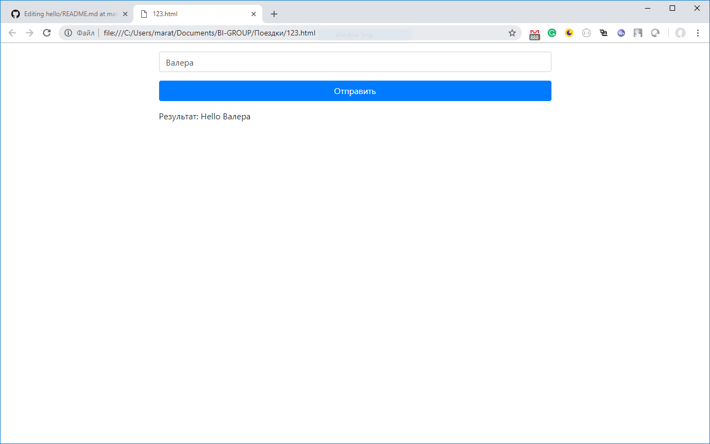

# Задание

1. Страничка с полем и кнопкой. Плюсом будет, если сделан на Bootstrap. Но не обязательно.
2. По нажатию на кнопку, должен отправляться запрос на REST сервис и возвращаться результат. Пример запроса - `{"name":"Бахтияр"}`
3. REST сервис принимает запрос и к имени возвращает строку - "Hello "+name. Пример ответа - `{"result": "Hello Бахтияр"}`
4. Проект должен состоять из двух папок - hello-web для Angular приложения и для hello-rest для rest сервиса.
5. Задание должно быть опубликовано на GitHub. Ссылку на проект необходимо отправить на эл.почту.

В помощь:
- Создать REST сервис - https://spring.io/guides/gs/rest-service/ (start.spring.io)
- Создать Angular приложение - https://medium.freecodecamp.org/learn-how-to-create-your-first-angular-app-in-20-min-146201d9b5a7
- Как работать с GIT - https://guides.github.com/activities/hello-world/

